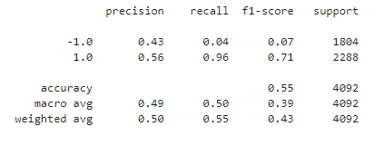
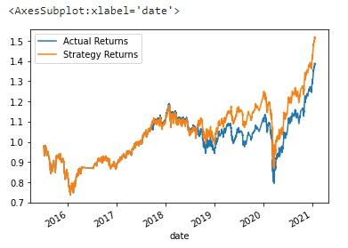
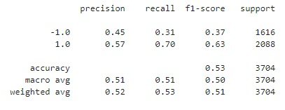
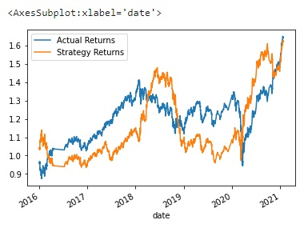
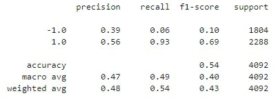
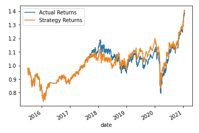
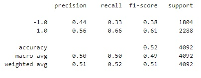
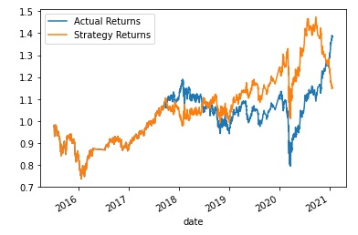

# Machine Learning Trading Bot

## Background

In this Challenge, you’ll assume the role of a financial advisor at one of the top five financial advisory firms in the world. Your firm constantly competes with the other major firms to manage and automatically trade assets in a highly dynamic environment. In recent years, your firm has heavily profited by using computer algorithms that can buy and sell faster than human traders.

The speed of these transactions gave your firm a competitive advantage early on. But, people still need to specifically program these systems, which limits their ability to adapt to new data. You’re thus planning to improve the existing algorithmic trading systems and maintain the firm’s competitive advantage in the market. To do so, you’ll enhance the existing trading signals with machine learning algorithms that can adapt to new data.

## Establish a Baseline Performance

In this section, the following steps are implemented:

1. Import the OHLCV dataset into a Pandas DataFrame.

2. Generate trading signals using short- and long-window SMA values.

3. Split the data into training and testing datasets.

4. Use the `SVC` classifier model from SKLearn's support vector machine (SVM) learning method to fit the training data and make predictions based on the testing data. Review the predictions.

5. Review the classification report associated with the `SVC` model predictions.

6. Create a predictions DataFrame that contains columns for “Predicted” values, “Actual Returns”, and “Strategy Returns”.

7. Create a cumulative return plot that shows the actual returns vs. the strategy returns. Save an image of this plot. This will serve as a baseline against which to compare the effects of tuning the trading algorithm.

8. Conclusion: this model performs especially well when predicts the "1.0" (buy signal). However, it does not predicts that well with "-1.0" (sell signal). The "Strategy Returns" line indicates a better performance than the "Actual Returns" line from the end of 2019 to the end of the period. 

## Tune the Baseline Trading Algorithm

1. Tune the training algorithm by adjusting the size of the training dataset. In this case, the training data is increased from 3 months to 6 months. And after this, a same process is implemented and SVM model is used. 

The classification report of this tuned-up model is as below:

Cumulative return plot that shows the actual returns vs. the strategy returns when utilising this extended training dataset:

2. Tune the trading algorithm by adjusting the SMA input features. 
In this case, the short window is increased to 6 and the long window is decreased to 60. The training dataset will be kept the same as the original model (3 months)

The classification report of this tuned-up model is as below:

 Cumulative return plot that shows the actual returns vs. the strategy returns when adjusting the SMA windows:

With this adjustment, it can be seen that the prediction accuracy is improved slightly for the "-1.0" (sell signals). However, looking at the plot, "The Strategy Returns" is relatively similar to the "Actual Returns". There is no significant improvement compared to the original model.

3. As showed above, extending the training data set (tune-up method 1) proves to considerably improve the prediction accuracy of the model for both "1.0" and "-1.0". This maybe the result of reducing the imbalance of the training dataset. Also, looking at the cummulative return plot, it can be seen that after around the 1st quarter of 2020, the "Stratefy Returns" is better than the "Actual Returns". But we also should take into account that the "Strategy Returns" is below "Actual Returns" during most of the trading period, especially from 2019 to 2020.

## Evaluate a New Machine Learning Classifier

In this section, Logistic Regression (LR) model is implemented.

2. Using the original training data as the baseline model, fit another model with the new classifier.

The classification report when using this alternative classifier is as below:

 Cumulative return plot that shows the actual returns vs. the strategy returns:

3. Compared the Logistic Regression classifier to the SVC classifier, the overal accuracy is not much different. However, the prediction accuracy for both "-1.0" and "1.0" when using Logistic Regression is much balanced, compared to the original SVC model.

Compared with tuned-up SVC model with extended training dataset, the prediction accuracy of the LR model is slightly better.

Compared with tuned-up SVC model with adjusted SMA windows, the prediction accuracy of the LR model is slightly better in general, and much better in predicting both "-1.0" and "1.0" values.

## Evaluation Report

With all the factors considered, it can be seen that extending the training period will improve significantly the accuracy of the SVC model for predicting both "-1.0" and "1.0" value. Adjusting the SMA windows only improve the general predicting accuracy slightly, but the imbalance between predicting accuracy for "-1.0" and "1.0" is similar. 

By using LR classifier, the result is similar to extending the training dataset of the SVC model, which is improving remarkably the predicting accury for both "-1.0" and "1.0" values. The general predicting accuracy is improve slightly. 

Looking at the cumulative return plots in all the models, it can be seen that the SVC model with extended training dataset has the "Strategy Returns" performing considerably better than "Actual Returns" after the 1st quater of 2020. However, "Strategy Returns" did not perform well in the previous period. In case of the LR classifier, the "Strategy Returns" outperforms the "Actual Returns" in most of the period. But it drops dramatically at the last quarter of 2021. The original SVC model and SVC model with adjusted SMA windows has a similar "Strategy Returns" to "Actual Returns".

---

## Submission

* Use the started code provided to create the machine learning trading bot and host the notebook and the required files.

* Include a `README.md` file with your conclusions as requested.

* Submit the link to your GitHub project to Bootcamp Spot.

---

© 2022 Trilogy Education Services, a 2U, Inc. brand. All Rights Reserved.
